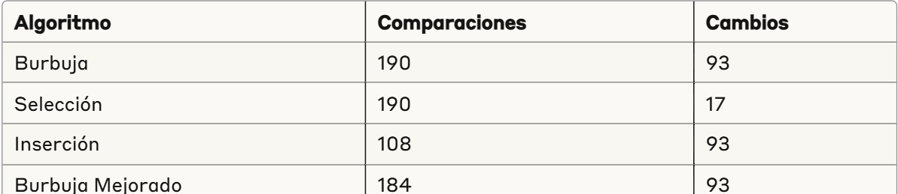

Práctica de Algoritmos de Ordenamiento
📌 Información General

Título: Algoritmos de Ordenamiento
Asignatura: Estructura de Datos
Carrera: Computación
Estudiante: Daniel Sanchez Valle
Ciclo: 2do Ciclo
Fecha: 31 de marzo de 2025
Profesor: ING. PABLO ANDRES TORRES PEÑA

🛠️ Descripción
Este proyecto implementa y compara diferentes algoritmos de ordenamiento en Java, permitiendo visualizar el proceso paso a paso. Los algoritmos implementados son:

Método Burbuja: Compara elementos adyacentes e intercambia si están en orden incorrecto.
Método Selección: Busca el elemento mínimo/máximo y lo coloca en la posición correcta.
Método Inserción: Construye el arreglo ordenado un elemento a la vez.
Método Burbuja Mejorado: Versión optimizada que termina anticipadamente si no hay intercambios.

✨ Características
El programa permite:

Elegir entre los cuatro algoritmos de ordenamiento
Seleccionar ordenamiento ascendente o descendente
Visualizar los pasos intermedios del proceso 
Ver estadísticas de rendimiento:

Número total de comparaciones
Número total de cambios realizados

🚀 Ejecución

📊 Visualización
La visualización detallada muestra:

El arreglo original
Cada comparación realizada
Intercambios efectuados
Estado actual del arreglo después de cada operación
Elementos fijados en su posición final
Estadísticas finales

💡 Resultados
Comparando los algoritmos con el mismo arreglo de entrada:

El método de Inserción realiza menos comparaciones
El método de Selección realiza menos intercambios
El Burbuja Mejorado termina antes que el Burbuja clásico

📋 Estructura del Proyecto

App.java: Clase principal con menú interactivo
MetodoBurbuja.java: Implementación del algoritmo Burbuja
MetodoSeleccion.java: Implementación del algoritmo Selección
MetodoInsercion.java: Implementación del algoritmo Inserción
MetodoBurbujaMejorado.java: Implementación del algoritmo Burbuja Mejorado

📝 Conclusiones

Eficiencia comparativa: El análisis de los resultados muestra que el algoritmo de Inserción realiza significativamente menos comparaciones (108) que Burbuja y Selección (190 cada uno), lo que lo hace más eficiente en términos de operaciones de comparación.
Optimización de intercambios: El método de Selección destaca por realizar solo 17 intercambios, mientras que los demás algoritmos requieren 93, demostrando su eficiencia en sistemas donde los intercambios son costosos.
Detección temprana: El algoritmo de Burbuja Mejorado demuestra su optimización al realizar 184 comparaciones frente a las 190 del Burbuja clásico, evidenciando la ventaja de la detección temprana de ordenamiento.
Aplicaciones prácticas: Cada algoritmo tiene escenarios óptimos de aplicación:

Inserción: Ideal para arreglos pequeños o parcialmente ordenados
Selección: Preferible cuando el costo de intercambio es alto
Burbuja Mejorado: Útil cuando se espera que el arreglo esté casi ordenado
